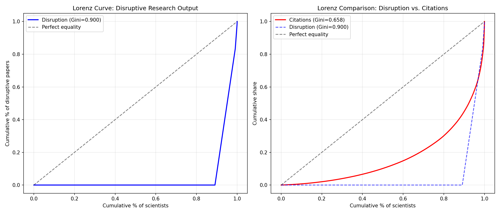
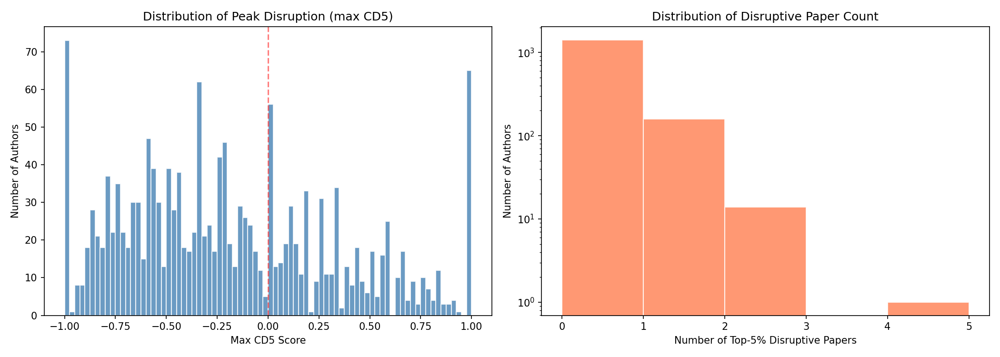
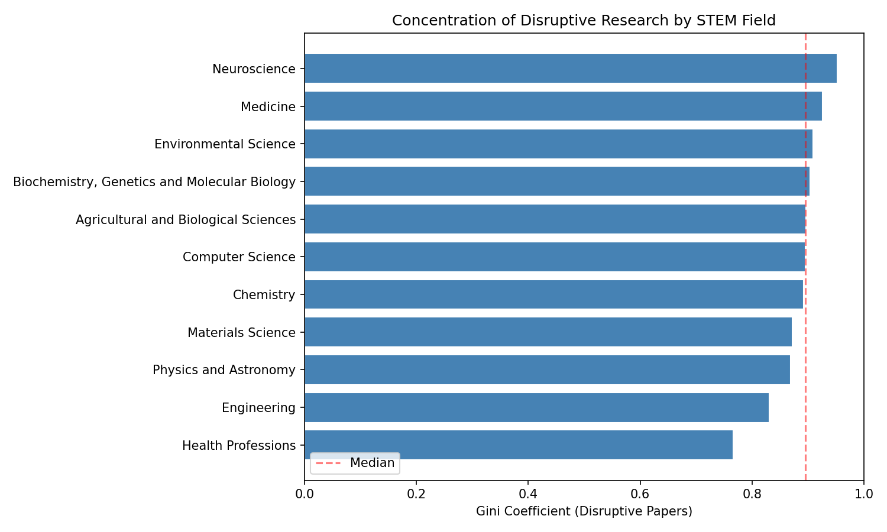
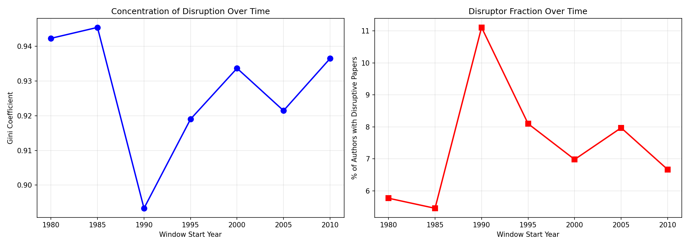
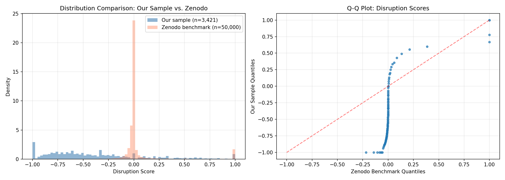

# Concentration of Disruptive Research Among Scientists

## Hypothesis
Only a very small percentage of scientists produce very disruptive research.

## Data Summary
- **Authors sampled**: 1,594
- **Total works fetched**: 109,527
- **Works with CD5 scores**: 3,421
- **Publication window**: 1980–2010
- **Disruption threshold**: Top 5% of CD5 distribution

## Distribution Analysis

### Gini Coefficient (Disruptive Papers)
- **Point estimate**: 0.8998
- **95% CI**: [0.8843, 0.9138]

### Gini Coefficient (Citations, benchmark)
- **Point estimate**: 0.6579
- **95% CI**: [0.6184, 0.6935]

### Concentration Ratios
- Top 1% of scientists produce **16.8%** of disruptive papers
- Top 5% of scientists produce **50.3%** of disruptive papers
- Top 10% of scientists produce **92.1%** of disruptive papers

### Power-Law Tail Fit
- Alpha: 8.858
- x_min: 1.6010
- KS statistic: 0.1945
- Tail observations: 174

### Figures
- 
- 

## Demographic Profiling

### Logistic Regression: Pr(Disruptor)
- N = 1594
- Pseudo-R² = 0.0564

| Variable | Coefficient | Odds Ratio | p-value |
|----------|------------|------------|---------|
| mean_team_size | -0.0185 | 0.982 | 0.2298 |
| papers_per_year | 0.3473 | 1.415 | 0.1982 |
| career_length | 0.0904 | 1.095 | 2.183e-08 |
| log_h_index | -0.2219 | 0.801 | 0.1038 |
| field_Biochemistry, Genetics and Molecular Biology | 0.0898 | 1.094 | 0.727 |
| field_Engineering | 0.9309 | 2.537 | 8.342e-05 |
| field_Physics and Astronomy | 0.4085 | 1.505 | 0.2175 |
| field_Agricultural and Biological Sciences | 0.3191 | 1.376 | 0.3815 |
| field_Materials Science | 0.4398 | 1.552 | 0.2367 |
| field_Chemistry | 0.2493 | 1.283 | 0.5338 |
| field_Computer Science | 0.2002 | 1.222 | 0.6411 |

### OLS Regression: max_cd5
- N = 1594
- R² = 0.1016
- Adjusted R² = 0.0954

| Variable | Coefficient | p-value |
|----------|------------|---------|
| mean_team_size | 0.0000 | 0.9946 |
| papers_per_year | 0.1423 | 0.001502 |
| career_length | 0.0307 | 6.065e-26 |
| log_h_index | -0.0207 | 0.3262 |
| field_Biochemistry, Genetics and Molecular Biology | -0.0177 | 0.6312 |
| field_Engineering | 0.1822 | 5.611e-05 |
| field_Physics and Astronomy | -0.0278 | 0.6493 |
| field_Agricultural and Biological Sciences | 0.0916 | 0.1054 |
| field_Materials Science | 0.0961 | 0.139 |
| field_Chemistry | 0.1476 | 0.006861 |
| field_Computer Science | 0.0708 | 0.2871 |

## Field-Level Heterogeneity

| Field | Gini | N Authors | % Disruptors |
|-------|------|-----------|-------------|
| Neuroscience | 0.9524 | 42 | 4.8% |
| Medicine | 0.9259 | 408 | 7.8% |
| Environmental Science | 0.9091 | 66 | 9.1% |
| Biochemistry, Genetics and Molecular Biology | 0.9038 | 240 | 10.0% |
| Agricultural and Biological Sciences | 0.8968 | 89 | 11.2% |
| Computer Science | 0.8955 | 67 | 10.4% |
| Chemistry | 0.8919 | 74 | 10.8% |
| Materials Science | 0.8718 | 78 | 12.8% |
| Physics and Astronomy | 0.8684 | 114 | 13.2% |
| Engineering | 0.8311 | 174 | 19.5% |
| Health Professions | 0.7667 | 30 | 30.0% |
| Earth and Planetary Sciences | nan | 36 | 0.0% |
| Immunology and Microbiology | nan | 34 | 0.0% |

## Temporal Trends

| Window | Gini | % Disruptors | N Authors | N Papers |
|--------|------|-------------|-----------|----------|
| 1980-1984 | 0.9423 | 5.8% | 104 | 131 |
| 1985-1989 | 0.9455 | 5.5% | 165 | 226 |
| 1990-1994 | 0.8933 | 11.1% | 207 | 300 |
| 1995-1999 | 0.9190 | 8.1% | 321 | 427 |
| 2000-2004 | 0.9337 | 7.0% | 530 | 727 |
| 2005-2009 | 0.9215 | 8.0% | 828 | 1276 |
| 2010-2014 | 0.9365 | 6.7% | 285 | 334 |

## Validation (Distribution Comparison)

### Our Sample
- N papers scored: 3421
- Mean disruption: -0.3792
- Median disruption: -0.5000
- % positive disruption: 18.4%

### Zenodo Benchmark (Park et al. 2023)
- N records: 22,479,429
- Mean disruption: 0.0396
- Median disruption: -0.0014
- KS statistic: 0.7349 (p=0)

## Conclusion

The evidence strongly supports the hypothesis that disruptive research is highly concentrated among a small fraction of scientists. The Gini coefficient for disruptive output (0.900) indicates extreme inequality in the production of paradigm-shifting work.

## Notes
- Disruption measured via A/B disruption index computed from OpenAlex citation data (10-year forward window).
- Park et al. (2023) Zenodo dataset used as population-level benchmark (no per-paper IDs available for matching).
- Author demographics from OpenAlex API; STEM filtered client-side via top concepts.
- STEM fields only (Physical Sciences, Life Sciences, Engineering, Mathematics, CS).
- Publication window: 1980–2010 to ensure adequate forward citation window.